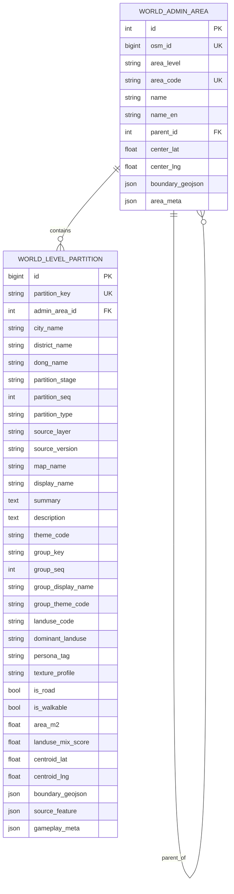
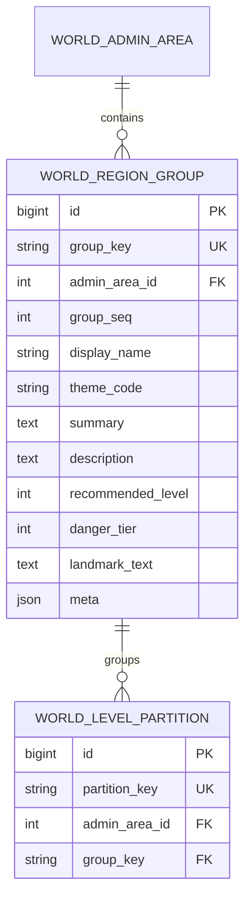

# World ERD

## Current Structure

The current world DB has two active responsibilities:

- `world_admin_area`: city, district, dong hierarchy
- `world_level_partition`: smallest gameplay partition

`group_*` fields in `world_level_partition` are not a separate table yet. They are grouping metadata used to bind multiple micro partitions into one playable region label.

## Why There Are Two Active Tables

- `world_admin_area` answers: "Which dong or district does this belong to?"
- `world_level_partition` answers: "Where exactly is the player standing?"

## Recommended Expansion For Codex

If the project will build a world codex, region lore, quest routing, monster habitat, and gatherable summaries, then a separate playable-region table is recommended.

- Keep `world_admin_area` for administrative hierarchy
- Keep `world_level_partition` for deterministic position lookup
- Add `world_region_group` for codex-facing playable regions

## Practical Rule

Use this mental model:

- `admin_area`: address hierarchy
- `region_group`: codex and content region
- `partition`: exact gameplay cell

This is the cleaner long-term shape for:

- world codex
- quest region references
- monster habitat references
- gatherable region references
- group boundary rendering
- current position lookup
